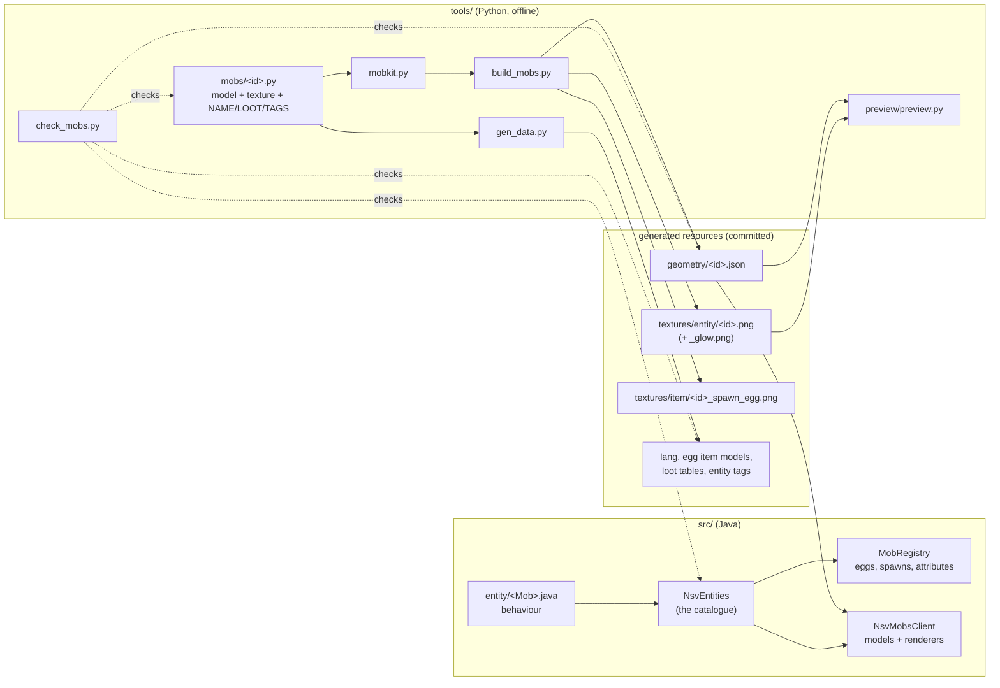

# Architecture

Not-So-Vanilla Mobs (mod id `nsvmobs`) is a Fabric mod for Minecraft 26.3 that adds mobs. It's
built so that each new mob is mostly **one Java class, one catalogue entry and one Python art
script**. Everything else (spawn eggs, spawn rules, models, names, loot, tags, tests) is wired up
from those.

## The big picture



**Python authors, Java runs.** A mob's look lives in its Python script. Running the script writes the
model as JSON plus the PNG textures. At startup the client turns the JSON into a vanilla model
layer, so the game draws exactly what the offline previewer shows.

## Repository layout

```
src/main/java/dev/nsvmobs/
  NsvMobs.java              mod entry point: loads the catalogue, wires it up
  NsvEntities.java          THE CATALOGUE: one MobEntry per mob (+ non-mob entities like projectiles)
  registry/MobEntry.java    what one mob is: type, attributes, spawn rule, biome spawns, RPG family
  registry/MobRegistry.java turns every entry into attributes, a spawn egg, spawn rules, biome spawns
  entity/                   one class per mob (behaviour), plus helpers (Griefing, WyrmlingEmber)
  compat/                   optional integrations (Village Friends RPG), applied only if installed
src/client/java/dev/nsvmobs/client/
  NsvMobsClient.java        model layer per catalogued mob + one renderer line per mob
  model/Geometry.java       geometry JSON -> LayerDefinition; finds parts by name
  model/CritterModel.java   base model for non-humanoids (head look, quadruped walk)
  model/<Mob>Model.java     per-mob animation
  render/                   ZombieVariantRenderer, SkeletonVariantRenderer, CritterRenderer,
                            CritterRenderState, GlowLayer, ScarecrowRenderer (zombie animation
                            with a daytime pose)
src/client/resources/assets/nsvmobs/geometry/   generated models (JSON)
src/main/resources/                             generated textures, lang, loot, tags; fabric.mod.json
src/gametest/                                   client game test (spawns every catalogued mob)
tools/                                          the art and data pipeline (Python 3 + Pillow)
DESIGN.md                                       what each mob is and does
```

## Java

### The catalogue (`NsvEntities`)
Every mob is declared once:

```java
public static final EntityType<Sporeling> SPORELING = MobEntry.builder("sporeling", Sporeling::new, MobCategory.MONSTER)
        .size(0.6F, 1.95F, 1.74F)                         // hitbox width, height, eye height (blocks)
        .attributes(Sporeling::createAttributes)
        .spawnRule(Monster::checkMonsterSpawnRules)       // when a natural spawn is allowed
        .spawnsIn(100, 1, 3, Biomes.MUSHROOM_FIELDS)      // weight, group min, group max, biomes
        .spawnsIn(40, 1, 2, Biomes.DARK_FOREST, Biomes.PALE_GARDEN)
        .rpgFamily("zombie")                              // optional: RPG add-on Bestiary family
        .register();
```

`register()` creates the entity type and records a `MobEntry`. At startup `MobRegistry.wireUp()`
goes through every entry and registers:
- default attributes;
- a spawn egg `nsvmobs:<id>_spawn_egg`, placed in the Spawn Eggs creative tab;
- the spawn rule;
- the biome spawns.

There's no list to keep in sync: being in the catalogue is what makes a mob exist. Entities that
aren't mobs (projectiles) are registered at the bottom with `misc(...)` and get none of this.

### Behaviour (`entity/`)
- Each mob extends the closest vanilla class: `Zombie`, `AbstractSkeleton`, `Monster`, `Animal`
  or `TamableAnimal`. That way it inherits vanilla AI, sounds, armour and despawning.
- Conventions:
  - **State the client must see** (sheared, burrowed, tongue lash) goes in `SynchedEntityData`.
    The renderer copies it into the render state.
  - **State that must survive a reload** is saved in `addAdditionalSaveData` / `readAdditionalSaveData`
    (`ValueOutput` / `ValueInput`).
  - **Block changes** are allowed only when `Griefing.allowed(level)` (the mobGriefing game rule).
  - **Sounds** reuse vanilla sound events, often pitch-shifted with `getVoicePitch()`.
  - **Burning, undead status and immunities** are vanilla entity type tags in 26.3, not methods.
    Set them through the mob script's `TAGS` (see below).
- Mobs never change vanilla or other mods' behaviour. No mixins into Minecraft or Village Friends.

### Client
- **Models:**
  - `NsvMobsClient` registers a model layer for every catalogued mob from
    `assets/nsvmobs/geometry/<id>.json` via `Geometry.load`.
  - Each mob then gets one renderer line.
  - If a catalogued mob has no renderer, startup throws, so a missing renderer can't go unnoticed.
- **Humanoid variants** (zombie- or skeleton-shaped) use `ZombieVariantRenderer` /
  `SkeletonVariantRenderer`. These reuse vanilla's animation, arm poses, held items and armour, so a
  variant needs no animation code. Its geometry must contain vanilla's part names; decorations are
  children of those parts.
- **Everything else** uses `CritterRenderer` with its own `CritterModel` subclass. The renderer's
  lambda copies entity state into `CritterRenderState`; add a field there when a new mob needs one.
- **Texture variants** (like the Hermit Crab's three shells, or the Penguin's chick and the Wild
  Boar's striped piglet): pass a list of texture names to `CritterRenderer` and set `state.variant`
  in the lambda (e.g. `e.isBaby() ? 1 : 0`). The art script saves the extra
  textures with `Model(..., texture_id="<id>_<variant>").save(geometry=False)`.
- **Hide-and-show poses** (a crab in its shell, a curled-up hedgehog): give the model a part for the
  alternate shape, or group the parts that disappear under one parent, and toggle `visible` in
  `setupAnim`.
- **Animation rule:** vanilla resets every part to its rest pose (from the JSON) before
  `setupAnim`, so animations add offsets (`part.xRot += ...`) on top of the authored pose. Find
  parts by name with `part("tail")` or `optional("ear")`.
- **Glow:** if the art script painted any `c.glow(...)` pixels, a `<id>_glow.png` exists and the
  renderers add a full-bright `GlowLayer` automatically.
- **Carried items** (the Goose's loot, the Raccoon's finds): the item is the mob's main-hand slot.
  Chain `.carriesItem("mouth")` onto its `CritterRenderer`, and give the model an empty part with
  that name where the item should sit. `MouthItemLayer` follows the part's animated pose.
- **Tint:** `CritterRenderState.tint` (ARGB, white by default) multiplies the whole model. The
  Chameleon sets it from the block it stands on, so its texture is painted pale and neutral.

### Compatibility
- **Versions:** Minecraft, Fabric Loader and Fabric API versions are pinned in `gradle.properties`
  to match Village Friends.
- **Village Friends RPG add-on:**
  - It identifies mobs by entity path only.
  - `compat/RpgBestiaryMixin` remaps paths using each entry's `rpgFamily`.
  - `CompatMixinPlugin` applies the mixin only when `villagefriends_rpg` is loaded, so the mod never
    depends on it.
- **Mixin package rule:** mixin classes live in `compat/mixin/` and nothing else does. Mixin
  refuses to load ordinary classes from a mixin package, so helpers like `RpgFamilies` must stay
  outside it. This mistake crashes the game only once the target mod calls in, which is why the
  modpack test below exists.
- **New integrations** go in `compat/`, behind the same kind of is-it-loaded check.
- **Modpack test:** `gradlew runClientGameTest -PtestHeap=2560m -PcompatMods=<mods folder>` copies
  the other mods' jars from that folder (e.g. the Village Friends instance's `mods`) into the test
  run. The showcase test then also checks that the RPG Bestiary files every mob under its
  catalogue `rpgFamily`. Run it before every release.

## The art and data pipeline (`tools/`)

Needs Python 3 and Pillow. The previewer also needs Microsoft Edge.

| Script | What it does |
|--------|--------------|
| `mobkit.py` | The modelling kit: `Model`, parts, cubes, face painters, `humanoid()` helper, `spawn_egg()` |
| `mobs/<id>.py` | One mob: `build()` (model + texture + egg) and `NAME`, `LOOT`, `TAGS` |
| `loot.py` | Loot pool helpers (`item`, `either`) in the 26.3 loot format |
| `build_mobs.py [id...]` | Runs `build()` for every (or the named) mob |
| `gen_data.py` | Writes lang, spawn egg item models, loot tables and vanilla entity tags from the scripts' metadata |
| `preview/preview.py <id> --views 4` | Renders a mob with headless Edge, using a port of Minecraft's cube/UV code |
| `check_mobs.py` | Fails if any mob is missing a piece: script, catalogue entry, renderer, geometry, texture, egg, loot, name |

### Model space (same as vanilla `ModelPart`)
- **Units and axes:** 1 unit = 1 pixel = 1/16 block. y points **down**; the mob faces **-z**; the
  mob's right side is **-x**. Feet rest at **y = 24**.
- **Parts:** a part has a pivot (offset from its parent) and a rotation in radians, applied Z, then
  Y, then X.
- **Cubes:** a cube has an origin relative to the pivot, a size, a texture offset (box UV) and an
  optional inflate. A size of 0 on one axis makes a flat plane; use it for leaves and wing
  membranes.
- **Painting:**
  - Each face gets a painter, a function that receives a `Canvas` in face-local pixels as seen from
    outside the mob.
  - Faces are named `front`, `back`, `right`, `left`, `top` and `bottom`.
  - `c.glow(x, y, colour)` also writes the pixel to the emissive layer.
  - `c.clear(x, y)` makes a pixel transparent (renderers use cutout).
- **Overlapping texture regions** raise an error. Mirrored cubes may share a region on purpose.
- **Pitfalls** (each one showed up while making a mob):
  - Use whole-number cube sizes and get fractions with `inflate`. A size like 1.5 samples the
    transparent texel next to the face and shows a thin sliver.
  - A flat plane (size 0 on one axis) needs the same paint on both of its faces, or they z-fight.
  - A cutout plane whose texture sits flush against another cube's pixels shows a hairline seam
    along its cut edge. Leave a 1 px empty border around it on the sheet.
  - The glow layer is added on top of the base texture, so a bright base under a glow pixel washes
    out to white. Give glowing pixels a dim base colour.

### Generated files are committed, never hand-edited
Geometry, textures, eggs, lang, item models, loot tables and the `data/minecraft/tags/entity_type`
files are all outputs. To change one, edit the mob's script and re-run the tools.

## Adding a mob

Example: a new zombie variant called `bog_mummy`.

1. **Design it** in `DESIGN.md`: looks, behaviour, biomes, drops, and the part names its animation
   will drive.
2. **Behaviour:** `src/main/java/dev/nsvmobs/entity/BogMummy.java`.
   - Extend the closest vanilla class.
   - Add `public static AttributeSupplier.Builder createAttributes()`.
   - Zombie variants override `setBaby` (no babies) and `convertsInWater` (`false`) like `Sporeling`.
3. **Catalogue it** in `NsvEntities`: `MobEntry.builder("bog_mummy", BogMummy::new, MobCategory.MONSTER)`
   plus its size, attributes, spawn rule, `spawnsIn(...)` and an optional `rpgFamily("zombie")`.
4. **Art:** `tools/mobs/bog_mummy.py`. Copy the nearest existing mob.
   - Build the model in `build()`, call `m.save()` and `spawn_egg(...)`.
   - Set `NAME`, `LOOT` and `TAGS`, e.g. `["zombies"]`, plus `"burn_in_daylight"` if it burns.
   - Check it with `python tools/build_mobs.py bog_mummy` and
     `python tools/preview/preview.py bog_mummy --views 4`.
5. **Data:** run `python tools/gen_data.py`.
6. **Client:** add one line to `NsvMobsClient`.
   - For a humanoid variant: `renderer(NsvEntities.BOG_MUMMY, ctx -> new ZombieVariantRenderer(ctx, "bog_mummy"));`
   - For anything else: write `model/BogMummyModel.java` (a `CritterModel`) and register a
     `CritterRenderer`. If the model needs extra entity state, add a field to `CritterRenderState`.
7. **Check:**
   - `python tools/check_mobs.py`
   - `gradlew build`
   - `gradlew runClientGameTest -PtestHeap=2g`: the showcase test spawns and photographs every
     catalogued mob automatically. Add a behaviour check there if the mob does something
     testable.
   - Then the same with `-PcompatMods=<Village Friends instance>/mods` to test inside the modpack.
8. **Docs:** add the mob to the README table.

## Minecraft 26.3 notes
Things that differ from older versions and from most tutorials:
- **Mappings:** the game ships unobfuscated with Mojang names. `ResourceLocation` is now `Identifier`.
- **Tags instead of methods:** daylight burning is the entity tag `minecraft:burn_in_daylight`.
  Freeze immunity, underwater breathing, fall damage immunity and undead/arthropod status are tags too.
- **Model layers:** register with Fabric's `ModelLayerRegistry` (not `EntityModelLayerRegistry`).
  Renderers use render states: `extractRenderState` fills a state, and the model's `setupAnim(state)`
  reads it.
- **Babies:** the entity says how small it is with `getAgeScale()`, but the renderer no longer shrinks
  it (vanilla swaps in separate baby models). `CritterRenderer.scale` applies the age scale itself.
- **Spawn eggs:** `new Item.Properties().setId(key).spawnEgg(type)`. Each egg has its own texture and
  an item model in `assets/<ns>/items/`.
- **Loot tables:** use `"modifier": [{"type": ...}]` and `"condition": {...}`, not `functions` /
  `conditions`.
- **Game rules:** `level.getGameRules().get(GameRules.MOB_GRIEFING)`. Rule names in commands are
  snake_case (`advance_time`).
- **Spawn placement:** `SpawnPlacements.register` is public through Fabric's access wideners.
- **Velocity sync:** to push a player, change their delta movement and set `needsSync = true`.
- **`/summon` with NBT** skips `finalizeSpawn`, so summoned skeletons and Gravewardens have no gear.
  Spawn eggs and natural spawns do get it.
